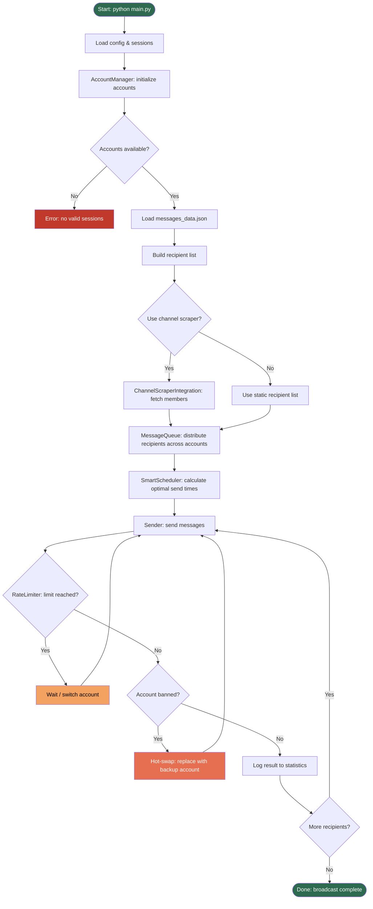

# 🤖 Telegram Multi-Account Message Sender

An advanced multi-account message broadcasting system with smart scheduling, Telegram channel scraper integration, and anti-ban protection.

## 🚀 Features

- 🔄 Multi-account support with automatic account switching
- 🛡️ Anti-ban protection with adaptive rate limiting
- ⚡ Smart scheduler with send-time optimization
- 📊 Telegram channel scraper integration
- 🎯 Send statistics and account monitoring
- 🔧 Hot-swap of blocked accounts
- 📈 Adaptive load distribution algorithms

## 📁 Project Structure

```
spam_bot/
├── src/
│   ├── __init__.py                              # Package initialization
│   ├── account_manager.py                       # Account management and status tracking
│   ├── auth_manager.py                          # Authorization and session management
│   ├── rate_limiter.py                          # Adaptive rate limit control
│   ├── smart_scheduler.py                       # Smart send scheduler
│   ├── sender.py                                # Core message sending logic
│   ├── message_queue.py                         # Message queue and distribution
│   ├── channel_scraper_integration.py           # Channel scraper integration
│   └── telegram_channel_scraper_single_json.py  # Telegram channel scraper
├── sessions/                                    # Account sessions
│   └── .gitkeep
├── data/                                        # Broadcast data
│   ├── messages_data.json
│   ├── failed_messages.json
│   └── message.txt
├── requirements.txt                             # Project dependencies
└── main.py                                      # Application entry point
```

## 🛠 Installation

1. `git clone https://github.com/Totsamuychel/Spam_bot.git && cd spam_bot`
2. `pip install -r requirements.txt`
3. Configure API credentials (`.env` or `config.json`)
4. Add account sessions to `sessions/`
5. Configure `data/messages_data.json`

## ▶️ Usage

```bash
python main.py
```

## 📄 messages_data.json Format

```json
{
  "message": "Text of the message to broadcast",
  "recipients": [
    {
      "user_id": 123456789,
      "username": "@username"
    },
    {
      "phone": "+1234567890"
    }
  ]
}
```

## 📋 Requirements

- Python 3.8+
- `telethon`, `asyncio`, `json`, `logging`, `datetime`, `random`

## 📈 Workflow



## 📄 License

MIT
